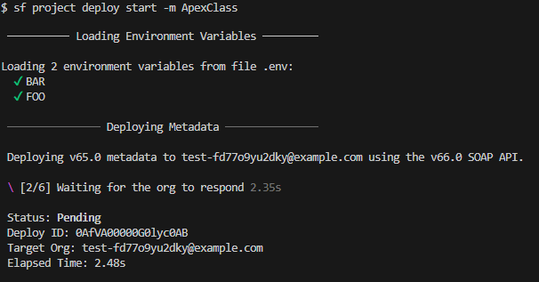
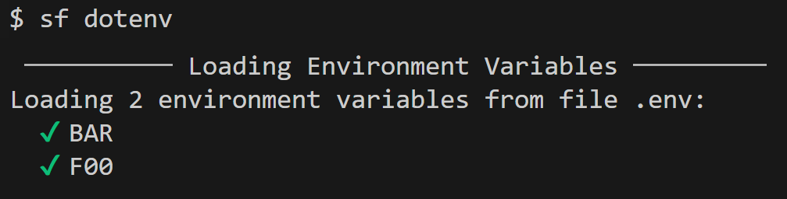
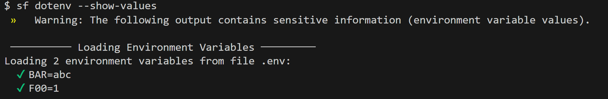

# Salesforce CLI DotEnv Plugin

A Salesforce CLI plugin that loads environment variables from `.env` files when you run `sf` commands. No need to export project-specific vars in your shell or OS.

## What It Does

- **Automatic loading**: A prerun hook loads a `.env` file (by default `.env` in the current directory) before every `sf` command. Values from the `.env` file override existing environment variables of the same name; variables not defined in the file are left unchanged.
- **Per-command file**: Use `--env` or `-e` with any command to load a specific file, e.g. `sf --env .env.prod project deploy start`.
- **Inspect loaded vars**: Run `sf dotenv inspect` to see which variables are loaded from `.env`; use `sf dotenv inspect --show-values` to print names and values (with a security warning).
- **Export from `sfdx-project.json`**: Run `sf dotenv export` to scaffold (or update) a `.env` file with every variable referenced by `replaceWithEnv` entries in your `sfdx-project.json`.

## Quick Start

Create a `.env` file in your project root:

```bash
FOO=123
BAR=some other value
```

Run any `sf` command, and the plugin automatically loads the file `.env` (if it exists). In this example of deploying Apex classes, the names of the loaded environment variables are displayed before the command executes.



## Installation

**Unsigned plugin**: This is a community plugin, so the `sf` CLI may prompt you to confirm installation. In CI/CD or non-interactive use, first add the plugin to the CLI allowlist so it installs without a prompt:

```bash
sf plugins trust allowlist add @jongpie/sf-dotenv-cli-plugin
sf plugins install @jongpie/sf-dotenv-cli-plugin
```

## Usage: Automatically Load `.env` Files with Any `sf` CLI Commands

**Automatic**: With a `.env` in your project root & the plugin installed, just run a `sf` command. Variables are loaded before the command runs.

**Specific file**: Pass the path of a specific `.env` file to load to the parameter `--env`

```bash
sf org list --env .env.local
sf project deploy start --env .env.production
```

### Using with `sf` CLI's Deployment String Replacements

The Salesforce CLI can [replace placeholders in metadata with environment variables](https://developer.salesforce.com/docs/atlas.en-us.sfdx_dev.meta/sfdx_dev/sfdx_dev_ws_string_replace.htm) during deployment. You define replacements in `sfdx-project.json` (e.g. `replaceWithEnv` pointing at an env var name), and the CLI substitutes those variables when you deploy. This plugin pairs well with that feature: put the replacement values in a `.env` file and they’re loaded automatically before `sf project deploy start` (or `sf deploy metadata`), so the CLI sees the variables without you exporting them in the shell.

**Example:** In `sfdx-project.json` you configure a replacement that uses the env var `NAMED_CREDENTIAL_URL`:

```json
{
  "name": "My Salesforce Project",
  "packageDirectories": [
    {
      "path": "force-app",
      "default": true
    }
  ],
  "replacements": [
    {
      "filename": "force-app/main/default/namedCredentials/My_Named_Credential.namedCredential-meta.xml",
      "stringToReplace": "https://placeholder.example.com",
      "replaceWithEnv": "NAMED_CREDENTIAL_URL"
    }
  ]
}
```

In your `.env`, add the environment variable value for `NAMED_CREDENTIAL_URL`:

```bash
NAMED_CREDENTIAL_URL=https://api.my-org.example.com
```

Then run your deploy as usual; the plugin loads `.env` before the command, and the CLI performs the replacement:

```bash
sf project deploy start --source-dir force-app
```

For different environments, use a separate env file and pass it to the command:

```bash
sf project deploy start --source-dir force-app -e .env.production
```

#### Scaffolding a `.env` File from `sfdx-project.json`

Rather than authoring a `.env` file by hand, you can let the plugin generate one from the `replaceWithEnv` entries in `sfdx-project.json`:

```bash
sf dotenv export
```

This reads `sfdx-project.json`, finds every `replaceWithEnv` reference under `replacements`, and writes the keys to a `.env` file in the current directory (default: `.env`). If the output file already exists, only missing keys are appended underneath an `# Auto-added by sf dotenv export` marker — existing entries are left untouched. Any matching variable already set in your shell's environment will be used as the default value; otherwise the key is written with an empty value for you to fill in.

Use `--output-file` (alias `-o`) to write to a different file:

```bash
sf dotenv export --output-file .env.local
sf dotenv export -o .env.production
```

## Usage: Debug & Test with `sf dotenv inspect` Command

**Inspect**: The plugin is primarily focused on automatically running during any `sf` CLI command. But to aid with debugging & testing, you can run the command `sf dotenv inspect` to see how your `.env` files are being loaded.

To see the names of environment variables being loaded, simply run the command:

```bash
sf dotenv inspect
```

This will attempt to load a `.env` file, and displays the names of any variables loaded:



> [!WARNING]
> If you want to see the names _and_ values, pass the flag `--show-values`. But doing so will display potentially sensitive values, so use this with caution.

```bash
sf dotenv inspect --env .env.staging --show-values
```



More details about this command (shown below) can be seen by running `sf dotenv inspect --help` or `sf dotenv inspect -h`.

```bash
USAGE
  $ sf dotenv inspect [--json] [--flags-dir <value>] [-e <value>] [--show-values]

FLAGS
  -e, --env=<value>  Path to the .env file to load. Defaults to the "default-env-file" `sf config`
                     value, then the SF_DOTENV_FILE environment variable, and finally ".env".
      --show-values  Print the loaded environment variable names and values.

GLOBAL FLAGS
  --flags-dir=<value>  Import flag values from a directory.
  --json               Format output as json.
```

## Configuration

- **Logging**: By default, the plugin logs the _names_ of loaded variables before each command. To turn this off, run:

  ```bash
  sf config set should-log-env false
  ```

  You can also change this setting globally by adding the flag `--global`. To re-enable logging, run: `sf config set should-log-env true`.

- **Default env file**: If your project uses a file other than `.env` (for example `.env.dev`), you can point the plugin at it via `sf config` instead of passing `--env` every time or exporting `SF_DOTENV_FILE`:

  ```bash
  # Applies to the current project only (stored in .sf/config.json)
  sf config set default-env-file .env.dev

  # Applies to every project on this machine
  sf config set default-env-file .env.dev --global
  ```

  Both `sf dotenv inspect` and `sf dotenv export` honor the same value, so reads and writes stay in sync. To remove the setting, run `sf config unset default-env-file` (add `--global` for the global scope).

  The full precedence order for choosing which env file to load is:
  1. `--env` / `-e` flag on the command
  2. `SF_DOTENV_FILE` environment variable
  3. `default-env-file` from `sf config` (local project scope, then global)
  4. `.env` in the current directory

- **Plugin-Specific Environment Variables**: A few environment variables can be set in your shell to control plugin behavior:
  - `SF_DOTENV_DISABLED` – set to `true` to disable automatic loading.
  - `SF_DOTENV_FILE` – path to the `.env` file used by automatic loading (takes precedence over `default-env-file` from `sf config`).
